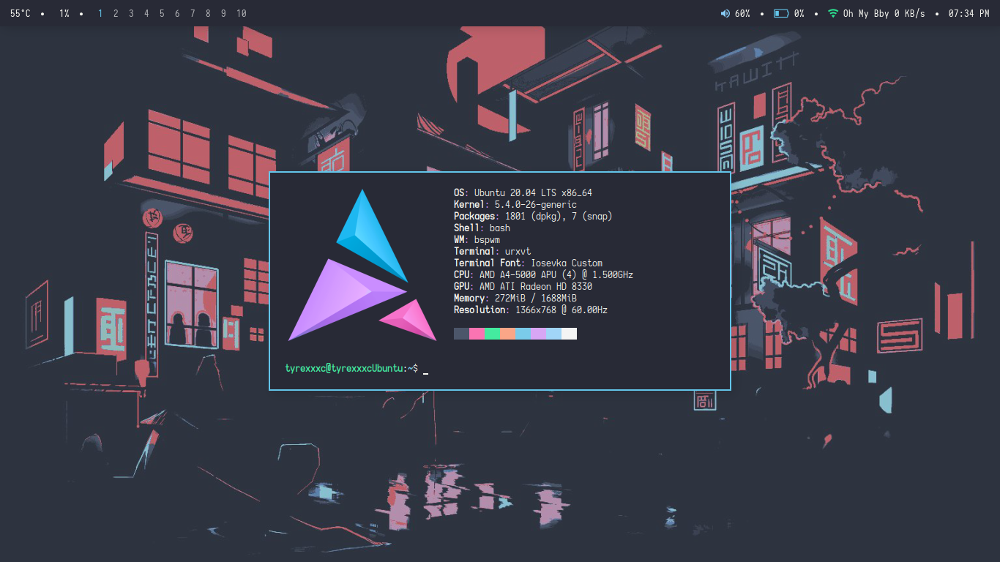

# dotfiles

Ubuntu 20.04 + bspwm

### This set up uses:

+ bspwm - to manage windows
+ sxhkd - hotkeys and stuff
+ bash - shell
+ urxvt - terminal
+ picom - compositor
+ dunst - notify daemon
+ rofi - application launcher
+ thunar - file manager
+ mpd + ncmpcpp - music player
+ vim, vscodium - text editor
